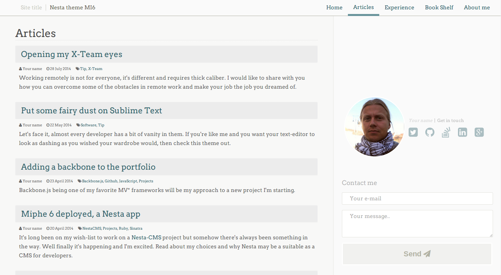

MI6 Nesta theme
===============



Mi6 is a theme for [Nesta, a Ruby CMS](http://nestacms.com) for developers and designers. A minimalistic and responsive theme developed for showcasing items and presenting various content, mostly for self-promotion (portfolio, skills, bio etc.).

Nesta is not the traditional CMS. There's no database, you write all your content with markdown, textile, haml, erb or other - it's your choice. You don't login to a web interface to make updates, there's no admin area. You write all content in your favorite text editor. Read more about how Nesta works on [the Nesta website.](http://nestacms.com)

## Requriements

- Bundler
- Nesta ~0.10.0

## Installation

You can install Nesta as [instructed here](https://github.com/gma/nesta), installing a theme is covered in the documentation.

## Getting started

To get some examples on how you may use this theme, please check out this repo [MI6 website](https://github.com/miphe/mi6). The content folder is all up to you, how to use it and what elements to add and where, even so it can be nice to have an example to browse through which you will find in the said link.

### First things first

- `config/config.yml`, when you have added all your own details here the site will feel more like your own (careful not to commit any sensitive information publicly).
- `content/pages/index.haml`, first page of your site.
- `docs/*`, here you can find some information about how to use features.

If you feel like something is missing, please let me know, there's still a lot of work to be done. Don't hesitate to contribute with a patch if you feel you've built something that could be useful for the theme.

### Test suite

This theme has a front-end js-test suite, running on Jasmine. You can find it on `http://localhost:9393/js-tests`. As more js-features are added this suite will expand as well. If you want to use the edge version of this theme, please make sure the suite passes.

### Setting up the front page

There are just two layouts in this theme, the site layout (`layout.haml`) and the test suite layout (`test_layout.haml`).

To change the appearence of the front page, you need to set a specific template (not layout) for that page. `front.haml` is a simplified template with a class on the `#content` element that is used for styling.

To use the `front.haml` template for your front page, add this row in your `content/pages/index.haml` file's metadata area:

`Template: front`

Nesta works a lot with these metadatas, [check out the full story here, you can do a lot of stuff with it.](http://nestacms.com/docs/creating-content/metadata-reference)

As of Nesta 0.10.0, the `Link text` metadata is requried.

```
Link text: Your own text
```

Make sure you separate the metadata part of your file from the content/markup part of your site with an empty line.

*Incorrect*
```haml
Link text: Home
Template: front
%h1
  Welcome to the front page!
```

*Correct*
```haml
Link text: Home
Template: front

%h1
  Welcome to the front page!
```

After that, the `index.haml` file will use that template for rendering content which will make that page look a bit different. It will be quite empty at first so you may want to [take a look at an example on how you may use the front page](https://github.com/miphe/mi6/blob/master/content/pages/index.haml).

### Setting up the primary menu

A complete guide on Nesta's menu system [can be found here](http://nestacms.com/docs/creating-content/menus). The primary menu on this theme only supports one level, a submenu or treemenu may be something I'll add later. Here's [an example of a primary menu](https://github.com/miphe/mi6/blob/master/content/menu.txt).

Items from `content/menu.txt` will need a flag to show up in the primary (top) menu. The rest (items that doesn't have this flag) of the first level menu items, they will show in the footer menu. This feels like a strange behavior and will probably come to change very soon when a refactoring/rebuild of the menu management is done.

The metadata flag you need to add to a content page is: `Flags: primary`.

---

- _Why the name "Mi6"?_ - short for miphe 6.0, the 6'th theme developed for the miphe.com domain.
